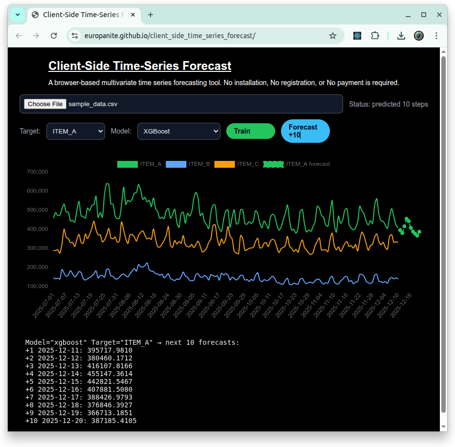

# [Client-Side Time-Series Forecast](https://github.com/europanite/client_side_time_series_forecast "Client-Side Time-Series Forecast")

[](https://opensource.org/licenses/Apache-2.0)

[](https://github.com/europanite/client_side_time_series_forecast/actions/workflows/ci.yml)
[](https://github.com/europanite/client_side_time_series_forecast/actions/workflows/docker.yml)
[](https://github.com/europanite/client_side_time_series_forecast/actions/workflows/pages.yml)


<p align="right">
  <a href="./README.md">🇺🇸 English</a> |
  <a href="./README.hi.md">🇮🇳 हिंदी </a> |
  <a href="./README.ja.md">🇯🇵 日本語</a> |
  <a href="./README.zh-CN.md">🇨🇳 简体中文</a> |
  <a href="./README.es.md">🇪🇸 Español</a> |
  <a href="./README.pt-BR.md">🇧🇷 Português (Brasil)</a> |
  <a href="./README.ko.md">🇰🇷 한국어</a> |
  <a href="./README.de.md">🇩🇪 Deutsch</a> |
  <a href="./README.fr.md">🇫🇷 Français</a>
</p>




[PlayGround](https://europanite.github.io/client_side_time_series_forecast/)

Un playground de pronóstico de series temporales multivariadas, basado en el navegador y ejecutado del lado del cliente, impulsado por XGBoost y una línea base experimental de estilo VARMA.

La aplicación carga un archivo CSV o XLSX, detecta columnas de fecha/hora y columnas numéricas, permite elegir un modelo de pronóstico y visualiza tanto los valores observados como un pronóstico de 10 pasos. Tus datos permanecen en tu navegador.

---

## Descripción general

Esta es una herramienta de pronóstico de series temporales multivariadas que se ejecuta completamente en tu navegador web.
No requiere instalación, registro ni pago.
Solo accede con tu navegador y puedes comenzar.
Ayuda a pequeñas empresas a predecir los pedidos de mañana.

- Cargar datasets de series temporales CSV/XLSX en el navegador
- Seleccionar cualquier columna numérica como objetivo del pronóstico
- Elegir entre el modelo XGBoost predeterminado y una línea base experimental de estilo VARMA
- Entrenar localmente el modelo seleccionado en el navegador
- Pronosticar los siguientes 10 puntos y agregarlos al gráfico

Todo ocurre **dentro de tu navegador**. No hay API de backend y ningún dato sale de tu máquina.

---

## Demo

1. Open the GitHub Pages demo:  
   https://europanite.github.io/client_side_time_series_forecast/
2. Upload a sample file such as [`data/sample_data.csv`](./data/datsample_dataa.csv) or [`data/sample_data.xlsx`](./data/sample_data.xlsx).
3. The app will:
   - Detect a **datetime-like column**
   - List available numeric columns
4. Choose one numeric column as the **target**.
5. Choose a **forecast model**. `XGBoost` is the default. `VARMA experimental` is a lightweight multivariate baseline for comparison.
6. Click **Train** to build the selected model, then click **Forecast +10** to predict the next 10 points.
7. Inspect the chart to compare the observed series and the forecast line.

---

## Estructura de datos

<pre>
datetime,item_a,item_b,item_c,...
2025-01-01 00:00:00+09:00,10,20,31,...
2025-01-02 00:00:00+09:00,12,19,31,...
2025-01-03 00:00:00+09:00,14,18,33,...
 ...
</pre>

### Requisitos:

##### Una columna similar a fecha/hora
El encabezado contiene "date" o "time" sin distinguir mayúsculas. Se usa como eje temporal, pero no se convierte directamente en características numéricas.

##### Una o más columnas numéricas
Estas columnas se usan como objetivo y/o características exógenas. La aplicación admite dos modos de pronóstico:

- **XGBoost**: eliges una columna numérica como objetivo y las demás columnas numéricas se usan como señales adicionales.
- **VARMA experimental**: todas las columnas numéricas se modelan juntas y la columna objetivo seleccionada se muestra como salida del pronóstico.

---

## Enfoque de pronóstico

El proyecto ofrece dos enfoques de pronóstico en el navegador: el modelo XGBoost predeterminado y una línea base experimental de estilo VARMA.

Para cada fila, la aplicación construye un vector de características a partir de:

- valores de rezago recientes
- diferencias locales
- medias móviles
- interacciones entre series
- índice temporal
- características cíclicas de estilo Fourier

La columna objetivo seleccionada se usa como etiqueta de predicción. El modelo aprende cómo el siguiente valor se relaciona con el comportamiento reciente del objetivo y de otras series numéricas.

### Selección de modelo

#### XGBoost

`XGBoost` es el modelo predeterminado. Es un modelo de regresión basado en características que usa valores rezagados, estadísticas móviles, interacciones entre series y características temporales. Úsalo cuando quieras el pronóstico general más sólido a partir de datos tabulares multivariados de series temporales.

#### VARMA experimental

`VARMA experimental` es una línea base multivariada ligera de estilo VARMA implementada en TypeScript. Pronostica series numéricas en conjunto y muestra la serie objetivo seleccionada.

Esta implementación es intencionalmente experimental. No es una implementación VARMA completa de máxima verosimilitud. Actualmente se comporta como un modelo autorregresivo de estilo VAR con estabilización residual y estacional, por lo que debe usarse como línea base de comparación y no como reemplazo de XGBoost.

Usa `VARMA experimental` cuando quieras comparar XGBoost con un modelo clásico multivariado de series temporales, especialmente cuando varias series numéricas se mueven juntas.

### Pronóstico de 10 pasos

La UI pronostica 10 puntos futuros. Cada paso futuro se agrega al historial de trabajo para que los pasos posteriores puedan usar valores predichos anteriormente.

Para datos multiserie, la aplicación también avanza el contexto numérico para que el pronóstico no mantenga simplemente cada columna no objetivo fija en el último valor observado. En modo XGBoost, el objetivo seleccionado se pronostica directamente mientras se extiende el contexto no objetivo. En modo VARMA experimental, todas las series numéricas avanzan juntas y la serie objetivo seleccionada se muestra en el gráfico y el texto del pronóstico.

---

## Ingeniería de características

Este proyecto trata la entrada como una pequeña serie temporal multivariada:

- Una columna *datetime-like* (el encabezado contiene `date` o `time` en cualquier combinación).
- Varias columnas numéricas (por ejemplo, `item_a`, `item_b`, `item_c`, ...).
- Una de las columnas numéricas se elige como **target** para pronosticar.

Internamente, el constructor de características crea un **rich feature vector** para cada paso temporal `t` y un **future feature vector** para `t + 1`. Todas las características se calculan **puramente en el cliente**, en JavaScript/TypeScript.

### Series usadas para las características

- `datetimeKey`  
  - Se detecta automáticamente a partir del encabezado que contiene `"date"` o `"time"`.
  - Solo se usa para ubicar el eje temporal; no se usa directamente como característica numérica.
- `targetKey`  
  - Columna numérica que el usuario elige pronosticar.
- `featureKeys`  
  - Todas las demás columnas numéricas (no datetime, no target).
  - Se tratan como **series exógenas**.

Internamente mantenemos un `seriesMap: Record<string, number[]>` con un arreglo numérico por serie.

### Características por serie (series exógenas)

Para cada serie exógena `x(t)` (cada clave en `featureKeys`) y cada paso temporal `t`, calculamos:

1. **Contemporaneous value**
   - `x(t)`

2. **Lag features (history)**
   - Up to `MAX_LAG = 3`:
     - `x(t - 1)`
     - `x(t - 2)`
     - `x(t - 3)`
   - This allows the model to learn short-term temporal dynamics per series.

3. **First difference**
   - `x(t) - x(t - 1)`
   - Captures local changes (trend / slope) rather than absolute level only.

4. **Rolling mean (local average)**
   - Rolling window of `ROLLING_WINDOW = 7` time steps:
     - `mean(x[t - 6 ... t])`
   - Represents local trend / baseline level and smooths short-term noise.

> If the series is shorter than the window, the code automatically shrinks the window so that all available past points up to `t` are used.

### Historial de la serie objetivo

Para la **target series** `y(t)`, no incluimos el valor actual `y(t)` como característica porque es la etiqueta de ese paso, pero sí incluimos su historial:

1. **Target lags**
   - `y(t - 1)`
   - `y(t - 2)`
   - `y(t - 3)`

2. **Target difference**
   - `y(t) - y(t - 1)`

3. **Target rolling mean**
   - Same rolling window as above:
     - `mean(y[t - 6 ... t])`

This lets the model learn patterns like “the next value depends on the last few values and their local trend,” which is typical in time-series forecasting.

### Interacciones entre series

Para capturar **relaciones entre diferentes series**, creamos características de interacción para cada **par de series numéricas** (incluido el objetivo):

- Let `v_i(t)` and `v_j(t)` be the contemporaneous values of two series at time `t`.
- For each ordered pair `(i, j)` with `i < j`, we compute:

1. **Spread**
   - `v_i(t) - v_j(t)`
   - Encodes relative level differences between series.

2. **Ratio**
   - `v_i(t) / v_j(t)`
   - To avoid division by zero, the denominator includes a small epsilon if needed:
     - `denom = |v_j| < 1e-9 ? sign(v_j) * 1e-9 : v_j`
   - Encodes relative scale and proportionality.

3. **Product**
   - `v_i(t) * v_j(t)`
   - Allows the model to express “interaction effects” where both series being large or small matters.

These cross-series features explicitly expose **multi-series structure** to the booster instead of relying only on individual series values.

### Índice temporal y características Fourier

También codificamos el tiempo mismo como características numéricas:

1. **Time index**
   - Integer index `t = 0, 1, 2, ...` (row index).
   - Gives the booster a simple way to model global trends.

2. **Fourier features** (cyclical patterns)
   - Two fixed periods (in units of “number of rows”):
     - Period 24 (e.g., 24 hours in hourly data)
     - Period 168 (e.g., 7 days × 24 hours)
   - For each period `P` we compute:
     - `sin(2πt / P)`
     - `cos(2πt / P)`
   - This is a standard way to embed seasonality/cycles in a form that tree models can still exploit.

The final feature vector for each time step `t` is:

```text
[ exogenous features (current, lags, diff, rolling mean for each series),
  target-series history (lags, diff, rolling mean),
  cross-series interactions (spread, ratio, product),
  time index, sin/cos(2πt/24), sin/cos(2πt/168) ]
```

### Vector de características del paso futuro (lastFeatureRow)
La misma lógica de construcción de características se usa para producir un vector para t + 1 (predicción a un paso):
- Conceptually, we treat the next time index as t_next = n where n is the number of observed rows.
- For the “current” values of each series at t_next, we reuse the last observed value (index n - 1).
- Lags and rolling means are computed using the last MAX_LAG / ROLLING_WINDOW steps in the observed data.
- Time encodings use t_next as the time index.
- This gives a single feature vector lastFeatureRow that represents the next time step based on all history up to the last observation.

The buildFeatures function therefore returns:
```text
{
  X: number[][];        // feature matrix for all observed steps
  y: number[];          // target series values for those steps
  lastFeatureRow: number[]; // feature vector representing t + 1
}
```

---


## 🚀 Primeros pasos

### 1. Requisitos previos
- [Docker Compose](https://docs.docker.com/compose/)

### 2. Construir e iniciar todos los servicios:

```bash

# Build the image
docker compose build

# Run the container
docker compose up

```

### 3. Test:
```bash
docker compose \
-f docker-compose.test.yml up \
--build --exit-code-from \
frontend_test
```

---

## Benchmark AirPassengers

El repositorio incluye un dataset AirPassengers y un comando de benchmark para comprobar el comportamiento del modelo frente a un dataset mensual clásico de series temporales.

Ejecuta el benchmark con Docker Compose:

```bash
docker compose -f docker-compose.test.yml run --rm air_passengers_benchmark
```

JSON output:

```bash
docker compose -f docker-compose.test.yml run --rm air_passengers_benchmark \
  node scripts/benchmark-air-passengers.mjs --json
```

Seasonal naive baseline:

```bash
docker compose -f docker-compose.test.yml run --rm air_passengers_benchmark \
  node scripts/benchmark-air-passengers.mjs --algorithm seasonal-naive --json
```

### AirPassengers xgboost benchmark

#### csv: data/air_passengers.csv
|  | This Work | seasonal-naive | 
| -------- | -------- | -------- |
| train_size | 120 | 120 | 
| test_size | 24 | 24 | 
| MAE | 43.6495 | 47.5833 | 
| RMSE | 50.8508 | 49.9867 | 
| MAPE | 9.5665% | 10.5227% | 
| sMAPE | 9.5943% | 11.1666% | 

---

# License
- Apache License 2.0
