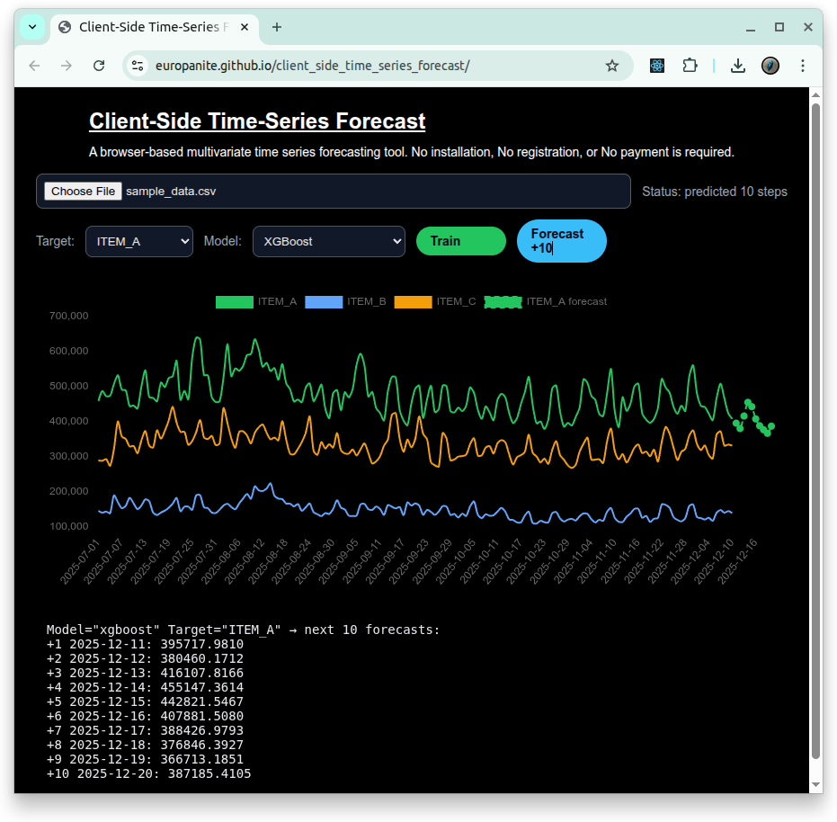

# [Client-Side Time-Series Forecast](https://github.com/europanite/client_side_time_series_forecast "Client-Side Time-Series Forecast")

[](https://opensource.org/licenses/Apache-2.0)

[](https://github.com/europanite/client_side_time_series_forecast/actions/workflows/ci.yml)
[](https://github.com/europanite/client_side_time_series_forecast/actions/workflows/docker.yml)
[](https://github.com/europanite/client_side_time_series_forecast/actions/workflows/pages.yml)


<p align="right">
  <a href="./README.md">🇺🇸 English</a> |
  <a href="./README.hi.md">🇮🇳 हिंदी </a> |
  <a href="./README.ja.md">🇯🇵 日本語</a> |
  <a href="./README.zh-CN.md">🇨🇳 简体中文</a> |
  <a href="./README.es.md">🇪🇸 Español</a> |
  <a href="./README.pt-BR.md">🇧🇷 Português (Brasil)</a> |
  <a href="./README.ko.md">🇰🇷 한국어</a> |
  <a href="./README.de.md">🇩🇪 Deutsch</a> |
  <a href="./README.fr.md">🇫🇷 Français</a>
</p>



[PlayGround](https://europanite.github.io/client_side_time_series_forecast/)

Um playground de previsão de séries temporais executado no lado do cliente e baseado no navegador, com XGBoost, LightGBM, um modelo experimental no estilo VARMA e Chronos-2.

O aplicativo carrega um arquivo CSV ou XLSX, detecta colunas datetime e numéricas, permite escolher um modelo de previsão e visualiza tanto os valores observados quanto uma previsão de 16 passos. Seus dados permanecem no navegador.

---

## Visão geral

Esta é uma ferramenta de previsão de séries temporais multivariadas que roda inteiramente no seu navegador.
Não requer instalação, cadastro ou pagamento. 
Basta acessá-la pelo navegador para começar.
Ela ajuda pequenas empresas a prever os pedidos do dia seguinte.

- Carregue conjuntos de dados de séries temporais CSV/XLSX no navegador
- Selecione qualquer coluna numérica como alvo da previsão
- Escolha entre XGBoost, LightGBM, um modelo experimental no estilo VARMA e Chronos-2 pré-treinado
- Treine localmente no navegador o modelo selecionado
- Preveja os próximos 16 pontos e adicione-os ao gráfico

Tudo acontece **dentro do seu navegador**. Não há API de backend e nenhum dado sai da sua máquina.

---

## Demonstração

1. Abra a demonstração no GitHub Pages:  
   https://europanite.github.io/client_side_time_series_forecast/
2. Faça upload de um arquivo de exemplo como [`data/sample_data.csv`](./data/datsample_data.csv) ou [`data/sample_data.xlsx`](./data/sample_data.xlsx).
3. O aplicativo irá:
   - Detectar uma **coluna semelhante a datetime**
   - Listar as colunas numéricas disponíveis
4. Escolha uma coluna numérica como **target**.
5. Escolha um **forecast model**. `XGBoost` é o padrão, `LightGBM` é uma alternativa GBDT treinada localmente, `VARMA experimental` é um baseline multivariado leve e `Chronos-2 pretrained` é um zero-shot foundation model.
6. Para XGBoost, LightGBM ou VARMA, clique primeiro em **Train**. O Chronos-2 já é pré-treinado e não requer treinamento local. Depois clique em **Forecast +16** para prever os próximos 16 pontos.
7. Observe o gráfico para comparar a série observada e a linha de previsão.

---

## Estrutura dos dados

<pre>
datetime,item_a,item_b,item_c,...
2025-01-01 00:00:00+09:00,10,20,31,...
2025-01-02 00:00:00+09:00,12,19,31,...
2025-01-03 00:00:00+09:00,14,18,33,...
 ...
</pre>

### Requisitos:

##### Uma coluna semelhante a datetime
O cabeçalho da coluna contém "date" ou "time" (sem diferenciar maiúsculas de minúsculas).
Ela é usada como eixo temporal, mas não é convertida diretamente em recursos numéricos.

##### Uma ou mais colunas numéricas
Essas colunas são usadas como target e/ou exogenous features.
O aplicativo oferece três modos de previsão ajustados localmente:

- **XGBoost**: você escolhe uma coluna numérica como target, e as demais colunas numéricas são usadas como sinais adicionais.
- **LightGBM**: usa o mesmo target e os mesmos recursos multivariados projetados do XGBoost, mas ajusta um LightGBM regressor.
- **VARMA experimental**: todas as colunas numéricas são modeladas em conjunto, e a coluna target selecionada é exibida como saída da previsão.

---

## Abordagem de previsão

O projeto disponibiliza quatro algoritmos de previsão com premissas deliberadamente diferentes:

| Modelo | Estilo de aprendizado | Usa várias séries de entrada? | Treinamento local? | Estilo de previsão |
| --- | --- | --- | --- | --- |
| XGBoost | Regressão com árvores de decisão gradient-boosted sobre recursos de séries temporais projetados | Sim | Sim | Previsão recursiva de um passo |
| LightGBM | Regressão com árvores de decisão gradient-boosted baseada em histogramas sobre os mesmos recursos projetados do XGBoost | Sim | Sim | Previsão recursiva de um passo |
| VARMA experimental | Autorregressão linear multi-output com ridge regularization, residual correction e seasonal stabilization | Sim, em conjunto | Sim | Previsão recursiva multi-output |
| Chronos-2-small INT8 ONNX | Modelo fundacional de séries temporais pré-treinado e baseado em patches | Apenas o target selecionado na UI atual | Não | Previsão probabilística multi-step direta |

Esses modelos não devem ser interpretados como quatro implementações do mesmo algoritmo. XGBoost e LightGBM convertem a série temporal no mesmo problema de aprendizado supervisionado tabular, VARMA modela em conjunto vetores defasados de várias séries, e Chronos-2 usa um modelo neural de previsão pré-treinado sem ajustar novos parâmetros ao conjunto de dados carregado.

### Seleção do modelo

#### XGBoost

`XGBoost` é o modelo padrão treinado localmente. XGBoost é um algoritmo de árvores de decisão com gradient boosting: várias árvores de decisão são adicionadas em sequência, e cada nova árvore reduz os erros deixados pelo ensemble anterior. As séries temporais não são fornecidas diretamente ao XGBoost. Este projeto primeiro transforma cada time step em um feature vector e depois treina o XGBoost como um modelo de regressão.

A implementação no navegador usa:

- lags do target e das variáveis exógenas até `MAX_LAG = 3`
- first differences
- uma rolling mean com `ROLLING_WINDOW = 7`
- interações spread, ratio e product entre séries numéricas
- um time index
- Fourier features com períodos 24 e 168
- `gbtree` com depth 4, learning rate 0.1, subsample 0.8 e 200 boosting iterations

Para uma previsão de 16 passos, o modelo prevê um passo por vez. Cada previsão é adicionada ao histórico de trabalho e, portanto, fica disponível para o próximo passo. A previsão bruta do XGBoost também é combinada com uma estimativa de seasonal continuation. O contexto numérico que não é target avança em vez de permanecer constante.

**Pontos fortes**

- captura relações não lineares e interações entre séries
- funciona naturalmente com os recursos multivariados projetados manualmente pelo projeto
- treina localmente e com relativa rapidez no navegador
- não exige o download de um grande modelo pré-treinado

**Limitações**

- a qualidade da previsão depende da feature engineering escolhida
- a previsão recursiva pode acumular erros nos passos mais distantes
- os períodos Fourier fixos e a seasonal continuation são premissas no nível da aplicação, e não uma estrutura de calendário aprendida automaticamente

Use XGBoost quando quiser um modelo não linear leve, treinado localmente, capaz de aproveitar relações entre várias colunas numéricas.

#### LightGBM

`LightGBM` é um segundo modelo de árvores de decisão com gradient boosting treinado localmente. A implementação no navegador usa `@wlearn/lightgbm`, uma build WebAssembly do LightGBM, e reutiliza intencionalmente a mesma saída de `buildFeatures()` e o mesmo fluxo de previsão recursiva de 16 passos do XGBoost.

A configuração padrão do LightGBM usa regression, learning rate 0.1, 31 leaves, max depth 4, subsample 0.8 e 200 boosting rounds. A previsão bruta da árvore é combinada com a mesma estimativa de seasonal continuation usada pelo XGBoost.

Use LightGBM quando quiser uma alternativa GBDT baseada em histogramas diretamente comparável, mantendo fixos o feature pipeline e o protocolo de previsão no nível da aplicação.

#### VARMA experimental

`VARMA experimental` é um baseline multivariado leve e nativo do navegador. Apesar do nome, esta implementação **não é um estimador VARMA estatístico completo de maximum likelihood**. Ela se aproxima mais de um modelo estilo VAR regularizado com uma pequena residual correction e seasonal stabilization explícita.

A implementação:

1. seleciona até 8 séries numéricas e as padroniza;
2. concatena os 7 vetores multivariados anteriores em um lag feature vector;
3. ajusta simultaneamente todas as séries de saída com multi-output ridge regression (`ridge = 1e-2`);
4. estima uma pequena correção a partir de resíduos recentes (`maLag = 1`);
5. durante a previsão, combina a saída autorregressiva com o vetor do seasonal lag (`seasonalLag = 7`, `seasonalBlend = 0.55`);
6. realimenta recursivamente o vetor previsto no próximo passo da previsão.

Como o vetor numérico completo é previsto a cada passo, o VARMA faz todas as séries modeladas avançarem juntas, em vez de prever somente o target selecionado.

**Pontos fortes**

- simples e computacionalmente barato
- modela várias séries numéricas em conjunto
- fornece um baseline útil no estilo linear/clássico em comparação com XGBoost e Chronos-2
- roda inteiramente em TypeScript sem exigir um download separado de modelo

**Limitações**

- exige pelo menos duas séries numéricas e mais de 7 linhas utilizáveis
- assume relações de lag predominantemente lineares
- a residual correction e o seasonal blending são estabilizadores pragmáticos, não um procedimento completo de moving-average estimation
- não deve ser apresentado como uma implementação de referência de VARMA estatístico

Use `VARMA experimental` principalmente como um baseline multivariado transparente quando várias séries se moverem em conjunto.

#### Chronos-2 pretrained

`Chronos-2 pretrained` é fundamentalmente diferente dos modelos ajustados localmente acima. O Chronos-2 é um time-series foundation model pré-treinado e baseado em patches que produz diretamente **quantile forecasts** multi-step. Este repository executa `Chronos-2-small INT8` como modelo ONNX com ONNX Runtime Web, portanto a inference é realizada localmente depois que o modelo é baixado.

A integração atual no navegador:

- **não** treina com o conjunto de dados carregado;
- usa apenas a série target selecionada como contexto do Chronos;
- exige pelo menos 16 observações numéricas do target;
- mantém no máximo 5.760 observações de contexto;
- agrupa a entrada em patches de 16 pontos e preenche à esquerda com `NaN` o primeiro patch incompleto;
- executa a saída interna de 672 passos do grafo ONNX (`42 × 16`) e expõe os primeiros 16 passos à UI;
- lê a saída de quantis do modelo e mostra a previsão mediana (`p50`) junto com os limites de incerteza `p10` e `p90`.

O próprio Chronos-2 oferece suporte a previsões multivariadas e informadas por covariáveis mais ricas, mas **a UI atual ainda não utiliza essas capacidades**. Portanto, a implementação atual do Chronos deve ser entendida como um previsor target univariado pré-treinado dentro de uma aplicação que, no restante, é multivariada.

**Pontos fortes**

- zero-shot forecasting: não é necessário ajustar um modelo por conjunto de dados
- prevê diretamente todo o horizonte de previsão em vez de ajustar recursivamente modelos de um passo
- fornece informações probabilísticas por meio dos quantis da previsão
- pode transferir para uma nova série padrões aprendidos durante o pré-treinamento em larga escala

**Limitações**

- o modelo precisa ser baixado antes do primeiro uso
- o navegador usa uma exportação INT8 ONNX, portanto os resultados não precisam coincidir exatamente com um checkpoint oficial de precisão completa
- a UI atual ignora colunas numéricas adicionais ao chamar o Chronos-2
- a memória do navegador e a execução WASM impõem limites práticos ao tamanho do modelo e ao comprimento do contexto

No benchmark holdout atual de AirPassengers 128/16 do repository, `Chronos-2-small INT8 ONNX` obteve os menores MAE, RMSE, MAPE, sMAPE e MASE entre os modelos comparáveis. Consulte a seção de benchmark abaixo para ver os valores medidos e o protocolo de avaliação.

### Previsão de 16 passos

O horizonte padrão no nível da aplicação é 16 porque o modelo ONNX integrado do Chronos-2 usa patches de 16 pontos, e as APIs de XGBoost, LightGBM e VARMA são alinhadas ao mesmo horizonte para comparação.

Os algoritmos chegam a esses 16 pontos de maneiras diferentes:

- **XGBoost** prevê recursivamente. Cada valor target previsto passa a fazer parte do histórico do próximo passo, enquanto o contexto não target também avança.
- **LightGBM** usa o mesmo engineered feature pipeline e a mesma política de previsão recursiva no nível da aplicação do XGBoost.
- **VARMA experimental** prevê recursivamente um vetor multivariado completo e realimenta esse vetor previsto no próximo passo.
- **Chronos-2** executa inference probabilística multi-step direta e retorna as primeiras 16 posições futuras da saída do modelo pré-treinado.

Essa diferença é importante na comparação dos modelos: XGBoost, LightGBM e VARMA podem acumular recursive forecast error, enquanto o Chronos-2 gera diretamente a sequência futura solicitada.

---

## Feature Engineering (XGBoost / LightGBM)

Os recursos projetados manualmente nesta seção se aplicam aos pipelines do XGBoost e do LightGBM. O VARMA usa diretamente vetores lag normalizados, enquanto o Chronos-2 opera sobre a sequência target selecionada sem esses recursos.

Os pipelines de tree boosting tratam a entrada como uma pequena série temporal multivariada:

- Uma coluna *datetime-like* (o cabeçalho contém `date` ou `time`, sem diferenciar maiúsculas de minúsculas).
- Várias colunas numéricas (por exemplo, `item_a`, `item_b`, `item_c`, ...).
- Uma das colunas numéricas é escolhida como **target** para previsão.

Internamente, o feature builder constrói um **rich feature vector** para cada time step `t` e um **future feature vector** para `t + 1`. Todos os recursos são calculados **inteiramente no cliente**, em JavaScript/TypeScript.

### Séries usadas nos recursos

- `datetimeKey`  
  - Detectado automaticamente a partir do cabeçalho que contém `"date"` ou `"time"`.
  - Usado apenas para localizar o eixo temporal; não é usado diretamente como recurso numérico.
- `targetKey`  
  - Coluna numérica que o usuário escolhe prever.
- `featureKeys`  
  - Todas as demais colunas numéricas (non-datetime, non-target).
  - Tratadas como **exogenous series**.

Internamente, mantemos um `seriesMap: Record<string, number[]>` com um array numérico para cada série.

### Recursos por série (exogenous series)

Para cada exogenous series `x(t)` (cada key em `featureKeys`) e cada time step `t`, calculamos:

1. **Valor contemporâneo**
   - `x(t)` (o valor no time index `t`).

2. **Lag features (history)**
   - Até `MAX_LAG = 3`:
     - `x(t - 1)`
     - `x(t - 2)`
     - `x(t - 3)`
   - Isso permite que o modelo aprenda a dinâmica temporal de curto prazo de cada série.

3. **First difference**
   - `x(t) - x(t - 1)`
   - Captura mudanças locais (trend / slope) em vez de apenas o nível absoluto.

4. **Rolling mean (local average)**
   - Rolling window de `ROLLING_WINDOW = 7` time steps:
     - `mean(x[t - 6 ... t])` (truncada perto do início da série)
   - Representa a tendência local / nível de base e suaviza o ruído de curto prazo.

> Se a série for menor que a janela, o código reduz automaticamente a janela para usar todos os pontos passados disponíveis até `t`.

### Histórico da série target

Para a própria **target series** `y(t)`, **não** incluímos o valor atual `y(t)` como recurso (porque ele é o rótulo desse passo), mas incluímos seu histórico:

1. **Target lags**
   - `y(t - 1)`
   - `y(t - 2)`
   - `y(t - 3)`

2. **Target difference**
   - `y(t) - y(t - 1)`

3. **Target rolling mean**
   - A mesma rolling window acima:
     - `mean(y[t - 6 ... t])`

Isso permite que o modelo aprenda padrões como “o próximo valor depende dos últimos valores e de sua tendência local”, algo típico em previsão de séries temporais.

### Cross-series interactions

Para capturar **relações entre diferentes séries**, construímos interaction features para cada **par de séries numéricas** (incluindo o target):

- Sejam `v_i(t)` e `v_j(t)` os valores contemporâneos de duas séries no tempo `t`.
- Para cada par ordenado `(i, j)` com `i < j`, calculamos:

1. **Spread**
   - `v_i(t) - v_j(t)`
   - Codifica diferenças relativas de nível entre as séries.

2. **Ratio**
   - `v_i(t) / v_j(t)`
   - Para evitar divisão por zero, o denominador inclui um pequeno epsilon quando necessário:
     - `denom = |v_j| < 1e-9 ? sign(v_j) * 1e-9 : v_j`
   - Codifica escala relativa e proporcionalidade.

3. **Product**
   - `v_i(t) * v_j(t)`
   - Permite ao modelo expressar “interaction effects” em que importa se ambas as séries são grandes ou pequenas.

Essas cross-series features expõem explicitamente a **multi-series structure** ao booster, em vez de depender apenas dos valores individuais das séries.

### Time index e Fourier features

Também codificamos o próprio tempo como recursos numéricos:

1. **Time index**
   - Integer index `t = 0, 1, 2, ...` (row index).
   - Oferece ao booster uma forma simples de modelar global trends.

2. **Fourier features** (cyclical patterns)
   - Dois períodos fixos (em unidades de “número de linhas”):
     - Period 24 (por exemplo, 24 hours em dados horários)
     - Period 168 (por exemplo, 7 days × 24 hours)
   - Para cada período `P`, calculamos:
     - `sin(2πt / P)`
     - `cos(2πt / P)`
   - Essa é uma forma padrão de incorporar seasonality/cycles em um formato que tree models ainda conseguem aproveitar.

O feature vector final para cada time step `t` é:

```text
[ exogenous features (current, lags, diff, rolling mean for each series),
  target-series history (lags, diff, rolling mean),
  cross-series interactions (spread, ratio, product),
  time index, sin/cos(2πt/24), sin/cos(2πt/168) ]
```

### Future-step feature vector (lastFeatureRow)
A mesma lógica de construção de recursos é usada para produzir um feature vector para `t + 1` (one-step-ahead prediction):
- Conceitualmente, tratamos o próximo time index como `t_next = n`, em que `n` é o número de linhas observadas.
- Para os valores “current” de cada série em `t_next`, reutilizamos o último valor observado (índice `n - 1`).
- Lags e rolling means são calculados usando os últimos `MAX_LAG` / `ROLLING_WINDOW` passos dos dados observados.
- As codificações de tempo usam `t_next` como time index.
- Isso fornece um único feature vector `lastFeatureRow` que representa o próximo time step com base em todo o histórico até a última observação.

Portanto, a função `buildFeatures` retorna:
```text
{
  X: number[][];        // feature matrix for all observed steps
  y: number[];          // target series values for those steps
  lastFeatureRow: number[]; // feature vector representing t + 1
}
```

---


## 🚀 Primeiros passos

### 1. Pré-requisitos
- [Docker Compose](https://docs.docker.com/compose/)

### 2. Faça o build e inicie todos os serviços:

```bash

# Build the image
docker compose build

# Run the container
docker compose up

```

### 3. Teste:
```bash
docker compose \
-f docker-compose.test.yml up \
--build --exit-code-from \
frontend_test
```

---

## AirPassengers Benchmark

Consulte [`BENCHMARKS.md`](./BENCHMARKS.md) para conhecer o protocolo justo de 16 passos e as regras de comparação com papers.

O repository inclui um dataset AirPassengers e um benchmark command para verificar o comportamento dos modelos em um conjunto de dados clássico de séries temporais mensais.

Execute o benchmark com Docker Compose:

```bash
docker compose -f docker-compose.test.yml run --rm air_passengers_benchmark
```

Saída JSON:

```bash
docker compose -f docker-compose.test.yml run --rm air_passengers_benchmark \
  node scripts/benchmark-air-passengers.mjs --json
```

Baseline seasonal naive:

```bash
docker compose -f docker-compose.test.yml run --rm air_passengers_benchmark \
  node scripts/benchmark-air-passengers.mjs --algorithm seasonal-naive --json
```


### Benchmark holdout de 16 passos

Os resultados a seguir usam o mesmo protocolo de avaliação fixed-origin para todos os modelos comparáveis:

- train: primeiras 128 observações de AirPassengers
- holdout: próximas 16 observações
- nenhum valor target do holdout é realimentado durante a previsão
- métricas pontuais comuns: MAE, RMSE, MAPE, sMAPE e MASE

Reproduza o benchmark com:

```bash
docker compose -f docker-compose.test.yml run --rm \
  air_passengers_benchmark \
  sh -lc '
    npm --prefix frontend/app ci &&
    node scripts/benchmark-air-passengers-fair.mjs --markdown
  '
```

Avaliação do AirPassengers apenas com LightGBM:

```bash
docker compose -f docker-compose.test.yml run --rm \
  lightgbm_air_passengers_benchmark
```

Isso executa o mesmo protocolo fixed-origin 128/16 com `--algorithm lightgbm`, então o resultado é diretamente comparável com as outras linhas de AirPassengers.

Resultados medidos anteriormente (a tabela é anterior à integração do LightGBM; execute o comando somente-LightGBM acima para gerar a linha atual do LightGBM):

| Model | Train | Horizon | MAE | RMSE | MAPE | sMAPE | MASE |
| --- | ---: | ---: | ---: | ---: | ---: | ---: | ---: |
| seasonal-naive | 128 | 16 | 64.2500 | 68.0808 | 14.1651% | 15.4031% | 2.1748 |
| xgboost | 128 | 16 | 24.5775 | 29.5014 | 5.5687% | 5.3717% | 0.8319 |
| LightGBM WASM | 128 | 16 | 21.0028 | 26.9474 | 4.4133% | 4.4352% | 0.7109 |
| Chronos-2-small INT8 ONNX | 128 | 16 | **14.7839** | **17.3376** | **3.2438%** | **3.2636%** | **0.5004** |
| VARMA experimental | 128 | 16 | N/A | N/A | N/A | N/A | N/A |

Neste holdout de 16 passos do AirPassengers, Chronos-2-small INT8 ONNX apresentou o menor erro em todas as métricas pontuais reportadas. Esta é uma comparação no nível da aplicação, e não uma reprodução direta dos scores agregados do paper do Chronos-2.

Sob o mesmo protocolo, LightGBM WASM superou o XGBoost em todas as métricas pontuais reportadas.

VARMA é reportado como N/A porque AirPassengers é univariado, enquanto a implementação experimental de VARMA deste repository exige pelo menos duas séries numéricas. Consulte [`BENCHMARKS.md`](./BENCHMARKS.md) para conhecer o protocolo multivariado e de comparação com papers.


## Multivariate LightGBM Benchmark

O repository também inclui uma avaliação fixed-origin multivariada do LightGBM usando `data/sample_data.csv`, que contém as séries numéricas `ITEM_A`, `ITEM_B` e `ITEM_C`.

Por padrão:

- as 16 últimas linhas são o holdout;
- as linhas anteriores formam a janela de training/context;
- cada coluna numérica é avaliada uma vez como target;
- as demais colunas numéricas ficam disponíveis para o mesmo engineered feature pipeline usado pelo aplicativo no navegador;
- nenhum valor numérico do holdout é realimentado durante a previsão recursiva;
- as séries não target avançam com a política de seasonal-continuation da aplicação;
- o LightGBM é comparado com um baseline seasonal-naive;
- MAE, RMSE, MAPE, sMAPE e MASE são reportados por target e como macro means.

Execute com Docker Compose:

```bash
docker compose -f docker-compose.test.yml run --rm \
  lightgbm_multivariate_benchmark
```

Saída JSON:

```bash
docker compose -f docker-compose.test.yml run --rm \
  lightgbm_multivariate_benchmark \
  sh -lc '
    npm --prefix frontend/app ci &&
    node scripts/benchmark-multivariate-lightgbm.mjs --json
  '
```

Avalie apenas um target:

```bash
docker compose -f docker-compose.test.yml run --rm \
  lightgbm_multivariate_benchmark \
  sh -lc '
    npm --prefix frontend/app ci &&
    node scripts/benchmark-multivariate-lightgbm.mjs \
      --target ITEM_A --algorithm lightgbm --markdown
  '
```

---

# Licença
- Apache License 2.0
